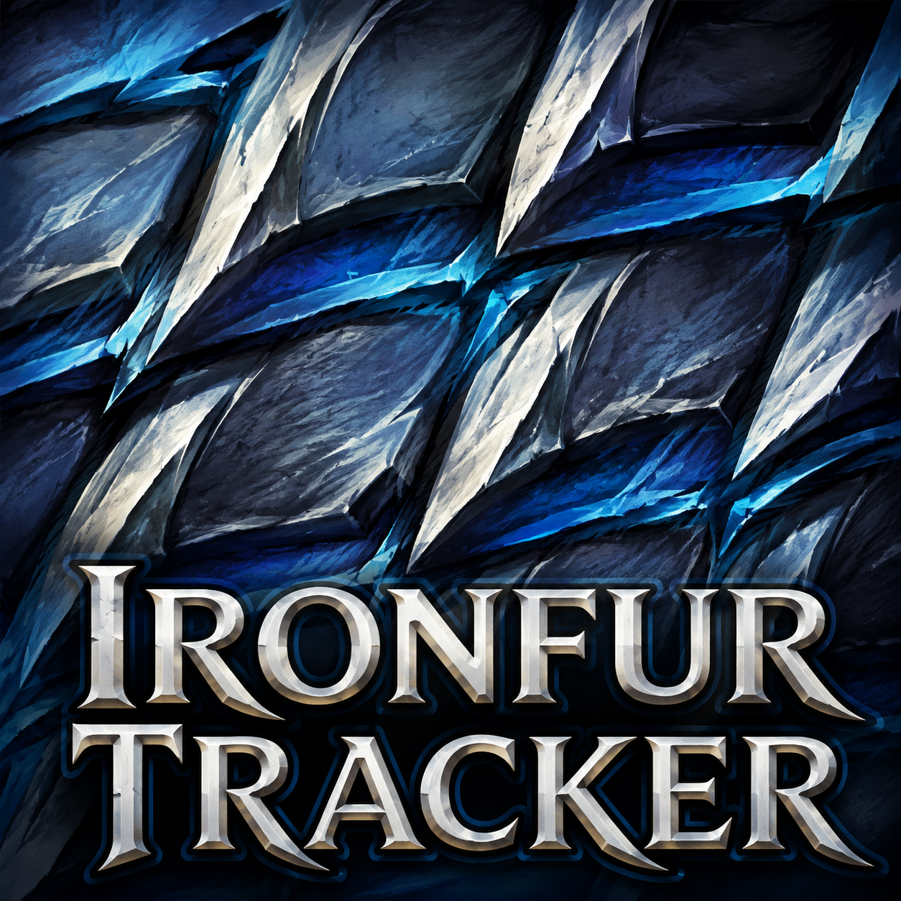
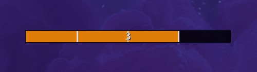
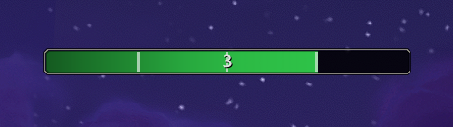
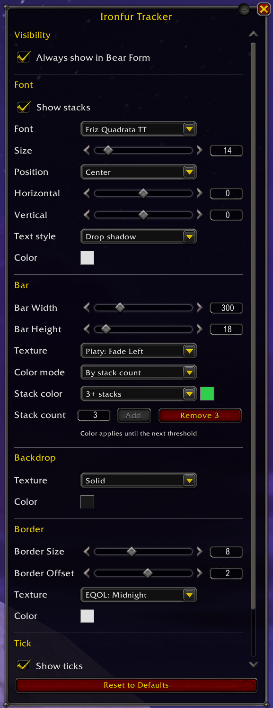

# Ironfur Tracker

Keep an eye on your Ironfur stacks without losing sight of the fight. Ironfur
Tracker brings your stacks and remaining time together in one customizable bar,
with a moving marker for each cast so you can see when applications are about
to expire. Make it your own through Blizzard's Edit Mode.

## Features

### Ironfur at a glance

- **Individual timers:** Each Ironfur cast adds its own moving tick marker.
- **Stack count:** See how many tracked applications remain, with optional stack text.
- **Bear Form visibility:** Works for every Druid specialization. Keep the empty bar visible, or hide it between Ironfur casts.
- **Talent support:** Accounts for Ursoc's Endurance and Guardian of Elune when timing new casts.
- **Wildshape Mastery:** Keeps existing timers running while the bar is hidden in Cat Form, then shows them when you return to Bear Form.

### Colors that tell the story

Choose the color mode that helps you read your Ironfur:

- **Class color:** Blizzard's Druid orange, enabled by default.
- **Solid:** Pick one color and opacity for the fill.
- **By stack count:** Choose colors for your own stack ranges. For example, set colors at 1 and 3 stacks to use the first color for both 1 and 2 stacks.
- **By time remaining:** Follow the bar fill with three configurable colors and fixed thresholds: green above 50%, yellow from above 25% through 50%, and red at 25% or less by default.

### Your bar, your style

- **Size and placement:** Adjust width and height, then drag the bar into place with Edit Mode's grid and snapping controls.
- **Textures:** Preview available bar, backdrop, and border textures before choosing. Fonts and textures shared by other installed addons are available too.
- **Backdrop and border:** Customize the empty part of the bar, border color, thickness, and offset, including opacity.
- **Stack text:** Choose a font, size, color, shadow or outline, alignment, and horizontal and vertical offsets.
- **Tick markers:** Show or hide ticks, and choose their width and color.
- **Live preview:** See appearance changes in Edit Mode, even outside Bear Form.
- **Saved settings:** Your position and appearance are shared across characters. Reset to Defaults gives you a fresh starting point whenever you want one.

## Screenshots

**Default appearance**

**WoW-style appearance**

**Settings**

## Getting started

1. Log in on a Druid and open **Edit Mode** from the game menu while out of combat.
2. Click the **Ironfur Tracker** preview to open its settings.
3. Drag the bar where you want it, then customize **Visibility**, **Font**, **Bar**, **Backdrop**, **Border**, and **Tick**.
4. Close Edit Mode and enter Bear Form to use the tracker.

Changes save automatically. Ironfur Tracker uses one account-wide setup,
independent of Blizzard's Edit Mode layout profiles. No slash commands or
separate settings addon are needed.

## Requirements

- World of Warcraft Retail **12.1.0**.
- A Druid character to display and customize the bar.

Required libraries are included. Extra media addons are optional.

## Installation

1. Download the addon ZIP and extract it into `World of Warcraft/_retail_/Interface/AddOns/`.
2. Check that the folder contains `AddOns/IronfurTracker/IronfurTracker.toc`.
3. Start World of Warcraft and enable **Ironfur Tracker** in the AddOns list.

## Tracking note

Ironfur Tracker estimates each application's remaining time from your successful
casts and supported talents. It cannot recover casts made before you log in,
reload the UI, or enter a new area through a loading screen. If Ironfur is
already active then, the display can temporarily show fewer stacks, including
zero. New casts are tracked immediately; once those older applications expire,
the display catches up.

## License and credits

[MIT](LICENSE). See [bundled libraries](docs/LIBRARIES.md) for third-party credits.

See the [changelog](docs/CHANGELOG.md) for what's new.
